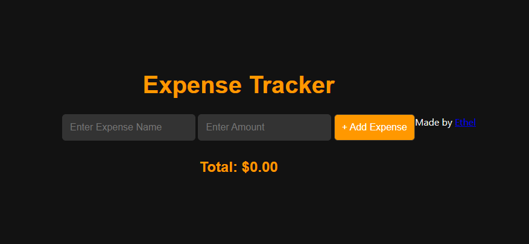

# Expense Tracker

A simple web application to track personal expenses.

## Description

This **Expense Tracker** helps users manage their finances by keeping track of their spending. It provides an easy way to add and monitor expenses, calculate total spending, and stay within budget.

## Why Use an Expense Tracker?

- **Stay Organized**: Keep all your expenses in one place.
- **Track Spending**: See where your money is going and identify areas to save.
- **Stay on Budget**: Easily monitor your total expenses and avoid overspending.

## Technologies Used

- HTML
- CSS
- JavaScript
